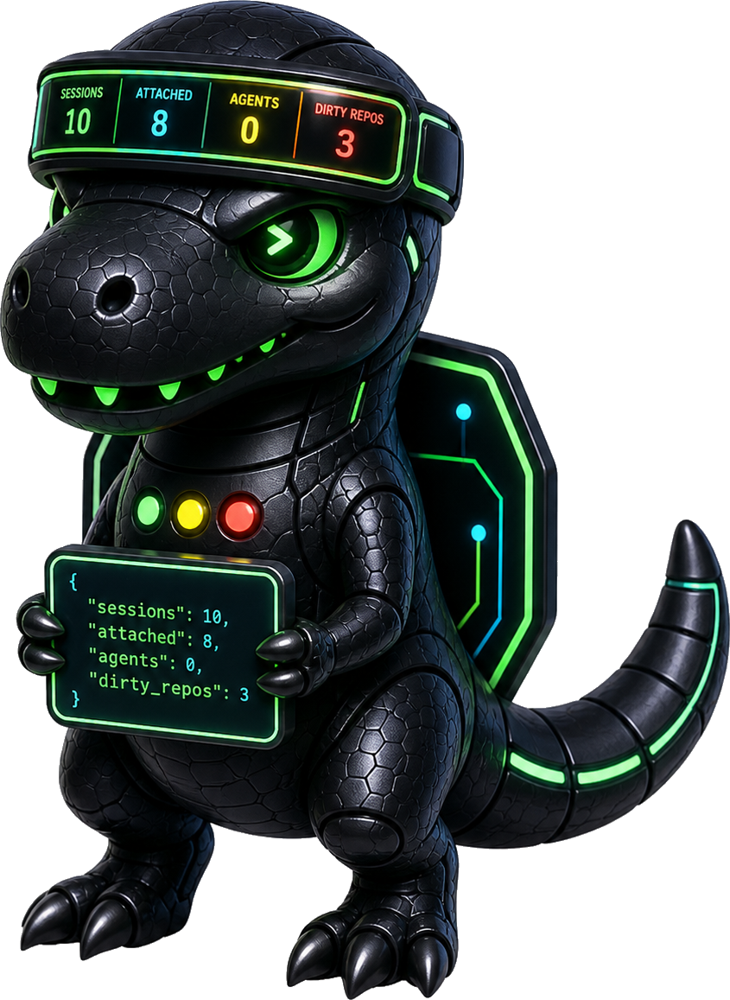

# trexbar-sway

<p align="center">
  
</p>

`trexbar-sway` is a read-only Sway/Waybar companion for `trex`. It uses `trex snapshot --json` as the backend contract, caches runtime state in Ruby, renders a compact Waybar chip, and opens a focused QuickShell modal.

V1 does not attach, switch, create, delete, or detach tmux sessions.

## Dependency

`trexbar-sway` depends on a `trex` binary that supports:

```bash
trex snapshot --json
```

Set `runtime.trexCommand` in `~/.config/trexbar-sway/config.json` when `trex` is not on `PATH`.

## Commands

```bash
trexbar-sway config init
trexbar-sway config validate
trexbar-sway refresh --format json --pretty
trexbar-sway daemon
trexbar-sway waybar render
trexbar-sway panel
```

Use `make check-trex` to verify the backend dependency from this checkout.

## Runtime Files

- Config: `~/.config/trexbar-sway/config.json`
- State: `~/.local/state/trexbar-sway/`
- Snapshot: `snapshot.json`
- UI state: `ui.json`
- Watch event: `state-event.json`

Waybar rendering reads cached state only. Live tmux, `/proc`, git, and resource reads happen during `refresh` or in the daemon.
